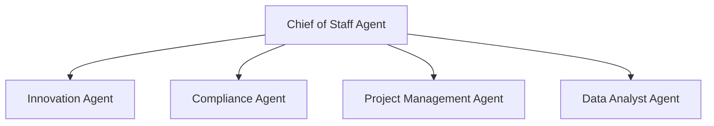

# Chief of Staff Multi-Agent Assistant

A governed executive decision-support prototype in which a Chief of Staff Agent orchestrates four specialist AI agents:

- Innovation Agent
- Compliance Agent
- Project Management Agent
- Data Analyst Agent

The Chief of Staff interprets an executive request, determines which specialists are needed, assigns focused work, reviews their findings, and produces one consolidated executive response.

## Architecture



The Chief of Staff remains responsible for the final response. Specialist agents provide structured analysis and recommendations but do not make or approve organizational decisions.

## Specialist Agents

| Agent | Purpose | Core skills |
|---|---|---|
| [Innovation Agent](https://github.com/bitamass/innovation_agent) | Discover, assess, prioritize, and advance innovation opportunities | Opportunity discovery; opportunity assessment and prioritization; experimentation and implementation |
| [Compliance Agent](https://github.com/bitamass/compliance_agent) | Identify applicable requirements, evaluate risks and controls, and escalate material concerns | Requirement and policy mapping; risk and control assessment; compliance review and escalation |
| [Project Management Agent](https://github.com/bitamass/project_management_agent) | Plan initiatives, monitor execution, and manage risks, assumptions, issues, decisions, and dependencies | Project planning and mobilization; execution and status management; RAID and decision management |
| [Data Analyst Agent](https://github.com/bitamass/data_analyst_agent) | Assess data, generate insights, and communicate evidence for executive decisions | Data intake, preparation, and quality; analysis and insight generation; visualization and executive narrative |

Each specialist repository contains reusable skills under:

```text
.agents/skills/<skill-name>/SKILL.md
```

The Chief of Staff application loads those skill instructions from the specialist repositories when the agents are created.

## Prototype Capabilities

The repository currently includes two related experiences:

### Executive meeting-preparation demonstration

The original Streamlit interface uses synthetic data to demonstrate:

- Initiative views
- Meeting intelligence
- Decision support
- Executive briefing
- Action and accountability tracking
- Risk and issue management
- Daily and weekly planning
- Skills-based analysis

### Multi-agent decision-support assistant

The Multi-Agent Assistant allows a user to submit an executive question. The Chief of Staff can consult one or more specialist agents and synthesize their findings into:

- Executive summary
- Evidence and assumptions
- Material findings
- Risks and limitations
- Recommendation
- Decisions needed
- Next actions and owners

## Repository Structure

```text
chief_of_staff_agent/
├── app.py
├── orchestrator.py
├── specialist_agents.py
├── specialist_skill_loader.py
├── requirements.txt
├── config/
│   └── specialist-agents.json
├── contracts/
│   ├── agent-assignment.schema.json
│   └── specialist-response.schema.json
├── pages/
│   └── 15_Multi_Agent_Assistant.py
├── sample_data/
└── 01_Executive_Prioritization/
    ...
```

## Assignment and Response Contracts

The Chief of Staff sends each specialist a structured assignment containing:

- Assignment identifier
- Target agent
- Objective
- Relevant context
- Requested skills and deliverables
- Constraints
- Available evidence
- Due date, when applicable

Every specialist returns a consistent response containing:

- Executive summary
- Findings
- Evidence
- Assumptions
- Risks
- Recommendation
- Decisions needed
- Next actions
- Confidence
- Limitations

This shared contract allows the Chief of Staff to combine findings from different specialists consistently.

## Safeguards

This prototype is designed for decision support and includes the following principles:

- Human review is required.
- Outputs are advisory, not approvals.
- Evidence must be separated from assumptions.
- Agents must not fabricate facts, policies, costs, or decisions.
- Material uncertainty and limitations must be disclosed.
- Legal and regulatory conclusions require qualified human review.
- Production, confidential, personal, regulated, or Epic data must not be used in this demonstration.
- Synthetic data is used for demonstration and testing.

## Local Setup

Python 3.12 is recommended.

Install the dependencies:

```bash
pip install -r requirements.txt
```

Set the OpenAI API key as an environment variable.

PowerShell:

```powershell
$env:OPENAI_API_KEY="your-api-key"
```

macOS or Linux:

```bash
export OPENAI_API_KEY="your-api-key"
```

Run the application:

```bash
streamlit run app.py
```

Do not commit API keys or `.streamlit/secrets.toml` to GitHub.

## Streamlit Deployment

For Streamlit Community Cloud, add the API key through the application’s private Secrets settings:

```toml
OPENAI_API_KEY = "your-api-key"
```

The API key must never be added directly to repository files.

## Example Multi-Agent Test

```text
We are considering a 90-day pilot of an AI assistant that summarizes
executive meeting materials and tracks follow-up actions using synthetic data.

Assess whether we should proceed. Evaluate the opportunity and expected value,
identify data requirements and success measures, review compliance and
governance risks, and propose a high-level pilot plan.
```

## Current Status

This is an exploratory prototype. It demonstrates multi-agent orchestration, skill-based specialization, structured delegation, and executive synthesis.

It is not connected to University of Washington production systems, Microsoft 365, Epic, or other institutional data sources.

## Author

Bita Massoudi  
Strategic Business Decisions Consulting
